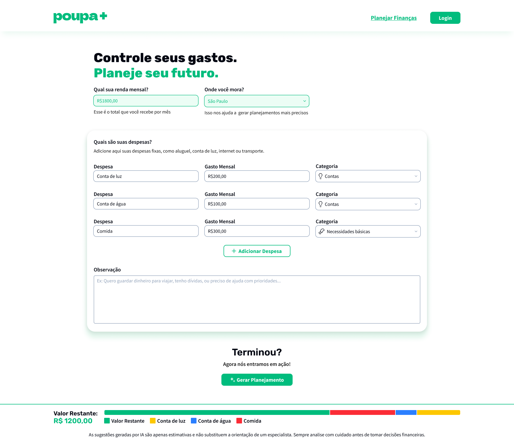
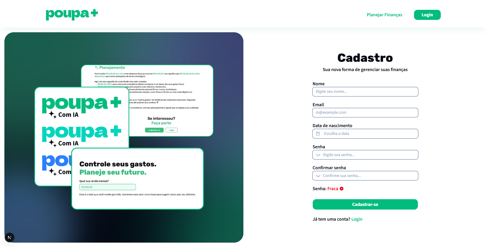
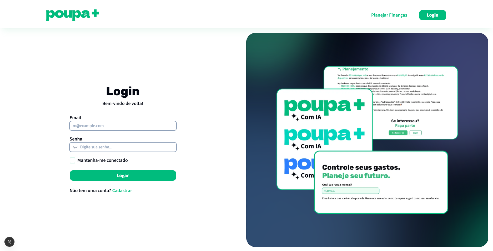

**Poupa+** é um sistema web de gerenciamento financeiro desenvolvido durante o projeto HackaTeen, ao longo de duas semanas, com o apoio da Venturus.

- [**Link do Site**](https://poupa-mais-venturus.vercel.app/)
- [**Documentação**](public/Documentação.pdf)

## 📖 Sumário

- [✨ Sobre o projeto](#-sobre-o-projeto)
- [💻 Tecnologias utilizadas](#-tecnologias-utilizadas)
  - [Front-end](#front-end)
  - [Back-end](#back-end)
  - [Libraries](#libraries)
  - [Frameworks](#frameworks)
  - [Dependências](#dependências)
- [📁 Como executar o projeto](#-Como-executar-o-projeto)
- [📷 Demonstração](#-demonstração)
- [💸 Contribuidores](#-contribuidores)

## ✨ Sobre o projeto

A proposta do Poupa+ é oferecer um **sistema de auxílio financeiro** no qual o usuário informa suas despesas mensais e, com base nesses dados, recebe sugestões personalizadas de planejamento financeiro. As recomendações são geradas por meio da inteligência artificial **[Llama](https://www.llama.com)**, promovendo uma gestão mais consciente e eficiente do dinheiro.

## 💻 Tecnologias utilizadas

### Front-end:


### Back-end:


### Libraries:


### Frameworks:


### Dependências:


## 📁 Como executar o projeto localmente

**1.** Baixe ou clone o projeto localmente, acesse ele em prompt de comando.

```bash
  # clone o repositório
  git clone https://github.com/Amanda093/poupa_mais
```

**2.** Execute o comando a seguir para a instalação das dependências:

```bash
npm install
```

**3.** Configure o .env definindo as variáveis de desenvolvimento

```tsx
// API KEY da hugging face
HUGGINGFACE_API_KEY=

// Variáveis do Firebase
FIREBASE_ADMIN_CLIENT_EMAIL=
FIREBASE_ADMIN_PRIVATE_KEY=

AUTH_COOKIE_NAME=
AUTH_COOKIE_SIGNATURE_KEY_CURRENT=
AUTH_COOKIE_SIGNATURE_KEY_PREVIOUS=

USE_SECURE_COOKIES=

NEXT_PUBLIC_FIREBASE_PROJECT_ID=
NEXT_PUBLIC_FIREBASE_API_KEY=
NEXT_PUBLIC_FIREBASE_AUTH_DOMAIN=
NEXT_PUBLIC_FIREBASE_DATABASE_URL=
NEXT_PUBLIC_FIREBASE_STORAGE_BUCKET=
NEXT_PUBLIC_FIREBASE_MESSAGING_SENDER_ID=
NEXT_PUBLIC_FIREBASE_APP_ID=

// Variáveis do Cloudinary
CLOUDINARY_CLOUD_NAME=
CLOUDINARY_API_KEY=
CLOUDINARY_API_SECRET=
```

**4.** Após a instalação, execute um dos comandos a seguir para abrir o projeto:

```bash
npm run dev
# ou
yarn dev
# ou
pnpm dev
# ou
bun dev
```

**5.** Abra [http://localhost:3000](http://localhost:3000) no seu navegador.

## 📷 Demonstração

**1.** Página Inicial


**2.** Página de Cadastro


**3.** Página de Login


## 💸 Contribuidores

<div align=center>
  <table>
    <tr>
      <td align="center">
        <a href="https://github.com/Amanda093">
          <br>
          <sub>
            <b>Amanda</b>
          </sub> <br>
        </a>
        <sub>
            amanda.rocha116@etec.sp.gov.br
          </sub>
      </td>
      </td>
      <td align="center">
        <a href="https://github.com/Apolo-Heh">
          <br>
          <sub>
              <b>Carlos</b>
            </sub> <br>
        </a>
        <sub>
            carlos.barile@etec.sp.gov.br
          </sub>
      </td>
      <td align="center">
        <a href="https://github.com/Miguel-Yudi">
          <br>
          <sub>
              <b>Miguel</b>
            </sub> <br>
        </a>
        <sub>
            miguel.baba@etec.sp.gov.br
          </sub>
      </td>
      <td align="center">
        <a href="https://github.com/osakirii">
          <br>
          <sub>
              <b>Sakiri</b>
            </sub> <br>
        </a>
        <sub>
            sakiri.cestari@etec.sp.gov.br
          </sub>
      </td>
    </tr>
  </table>
<div>
